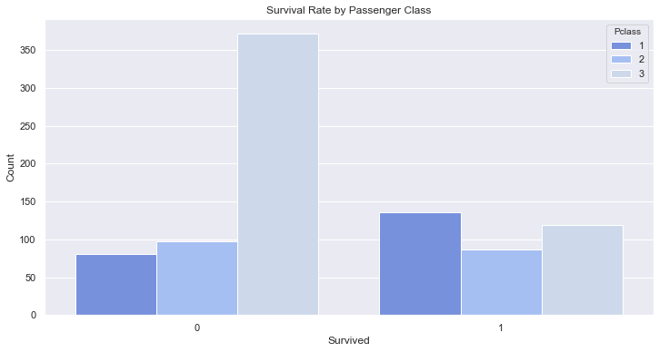

# Titanic

In this project I attempted the titanic competition on kaggle.com and the data was collected from the kaggle website in csv form. The final model had an accuracy of 0.78947 on the test set.

The data was already split into a training and test set, where the test set did not disclose the target variable. The data had 11 predictor variables. The goal of the competition is to produce the best model to predict whether a passenger on the titanic survives or dies. I split my work into four notebooks: 

- Exploratory Data Analysis
- Cleaning
- Feature Engineering
- Modelling

## EDA

In this section I identified columns with missing values, analysed the distributions of the different columns and created visualisations for each column and the relationship with the target variable. During this time, I attempted to understand the data and to brainstorm possible options for feature engineering and how best to represent the data for a machine learning model to use the data. Some of the interesting visualisations I produced:

## Cleaning

In the cleaning notebook I identified any duplicate data, filled missing values and removed non-informative columns. For most missing values I used the other values in the column to estimate the missing values (mean, median, mode). For the missing age values of passengers I trained a lasso regression model using cross validation to more accurately predict ages.

## Feature Engineering

In this notebook I attempted to create useful predictors from existing data and converted nominal data to binary dummy variables. The features I created were:

- Deck. Although a lot of the Cabin data was missing, there were was some useful information. The cabin codes included a deck, I was then able to create an ordinal predictor that decribed the deck the passenger was staying on.
- Relatives. This was a linear combination of siblings, spouses, parents and children on board (SibSp + Parch).
- Title. Using the existing Name data I was able to isolate the title of each passenger.
- Child. I created a child indicator variable for anyone under the age of 13.

## Modelling

Here I used two different feature selection methods to create a subset of useful features to train a selection of models on and then tuned the parameters in the best performing model.

#### Feature Selection:

The two methods used to select the features were:

- Univariate feature selection - Here as I had a mix of nominal, ordinal and continuous data I converted all of the continuous data to discrete by using bins and then used a chi square test to value the association of each feature with the target variables and used the top 8 features.
- Recursive feature elimination - I used recursive feature elimination with a logistic regression model and cross validation to find an optimal subset of features.

#### Models:

The models I trained were:

- Decision tree
- Random forest
- SVM
- K nearest neighbours

I evaluated each model using  10 fold cross validation and the accuracy and chose the SVC as the model with the highest mean accuracy and a low standard deviation of accuracy. I then used a grid search method to tune the parameters in the model, finding that a rgb kernel perfomed the best.

## Evaluation

The accuracy of the model when evaluated using 10 fold cross validation on the training set was a mean of 0.834 with a standard deviation of 0.038. When uploaded to kaggle the model had an accuracy of 0.78947, indicating my model was slightly overfitting the data.

